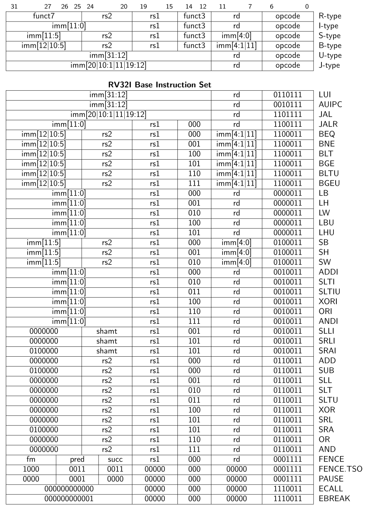

# RISC-V Instruction Set

## Instructions

### LUI (Load Upper Immediate)
`rd = imm << 12`
Loads an immediate value into the upper bits of a register.

### AUIPC (Add Upper Immediate to PC)
`rd = PC + (imm << 12)`
Loads an immediate value into the upper bits and adds it to the PC.

### JAL (Jump and Link)
`rd = PC + 4; PC = PC + imm`
Jumps to an address and saves the return address in `rd`.

### JALR (Jump and Link Register)
`rd = PC + 4; PC = (rs1 + imm) & ~1`
Jumps to an address specified in a register and saves the return address.

### BEQ (Branch if Equal)
`if (rs1 == rs2) PC = PC + imm`
Jumps to an address if two registers are equal.

### BNE (Branch if Not Equal)
`if (rs1 != rs2) PC = PC + imm`
Jumps to an address if two registers are not equal.

### BLT (Branch if Less Than)
`if (rs1 < rs2) PC = PC + imm`
Jumps to an address if one register is less than another (signed).

### BGE (Branch if Greater or Equal)
`if (rs1 >= rs2) PC = PC + imm`
Jumps to an address if one register is greater than or equal to another (signed).

### BLTU (Branch if Less Than Unsigned)
`if (rs1 < rs2) PC = PC + imm`
Jumps to an address if one register is less than another (unsigned).

### BGEU (Branch if Greater or Equal Unsigned)
`if (rs1 >= rs2) PC = PC + imm`
Jumps to an address if one register is greater than or equal to another (unsigned).

### LB (Load Byte)
`rd = M[rs1 + imm]`
Loads a byte from memory and sign-extends it.

### LH (Load Halfword)
`rd = M[rs1 + imm]`
Loads a halfword from memory and sign-extends it.

### LW (Load Word)
`rd = M[rs1 + imm]`
Loads a word from memory.

### LBU (Load Byte Unsigned)
`rd = M[rs1 + imm] & 0xFF`
Loads a byte from memory and zero-extends it.

### LHU (Load Halfword Unsigned)
`rd = M[rs1 + imm] & 0xFFFF`
Loads a halfword from memory and zero-extends it.

### SB (Store Byte)
`M[rs1 + imm] = rs2`
Stores a byte in memory.

### SH (Store Halfword)
`M[rs1 + imm] = rs2`
Stores a halfword in memory.

### SW (Store Word)
`M[rs1 + imm]...
